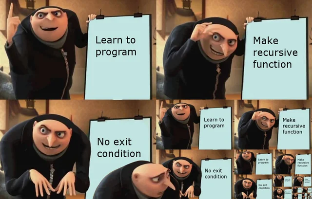
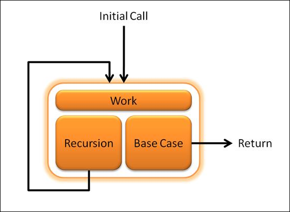
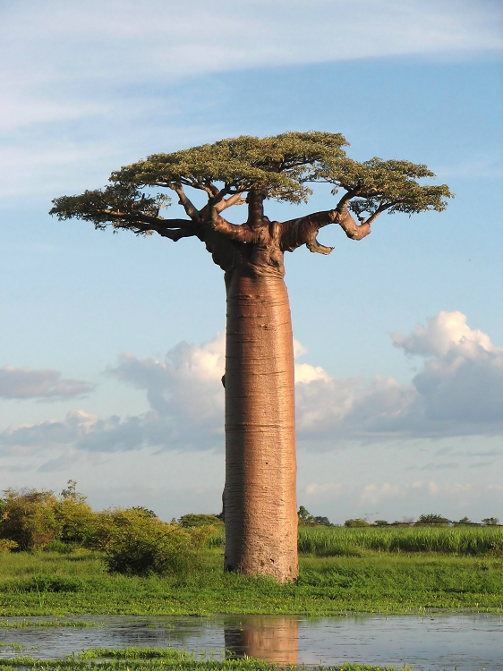
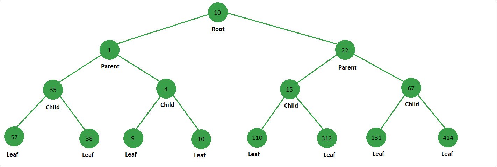

# Recursion

When writing code, functions are very helpful as they allow us to reuse code without rewriting each line. A function is
typically called from outside the scope of the function itself. In _**recursion**_, instead of calling the function from
outside the function, the function is called by itself. Because of this, it is very easy to create an infinite "loop".
This is less than desirable as the efficiency of recursion is **O(2^n)**. 

To avoid unnecessary time and infinite recursion, it is important to design a recursion problem with two things in mind:
1. Make sure the problem gets smaller with each recursion call
2. Define at least one instance in which recursion will not happen. This is called a **base case**. It is typically just
a simple if/else statement.
   

Above we can see that the base case allows an exit from the recursion. Creating a base case that will eventually
execute is important. It is also possible to have more than one base case. Whether or not this is necessary depends on
the desired function as well as if at least one of the base cases will execute.

# Binary Trees

This is not a binary tree. This is a Baobab tree. Easy mistake.

This is a Binary tree. A binary tree is made of nodes that individually connect up to two different nodes. There are a
few different terms related with a binary tree:
1.**Root**: The first node is called the _root_ node
2.**Parent**: A node that is connect to lower nodes is called a _parent_ node
3.**Child**: A node connected to a parent node is called a _child_ node
4.**Leaf**: Nodes without any connecting nodes are _leaf_ nodes

## Binary Search Trees
