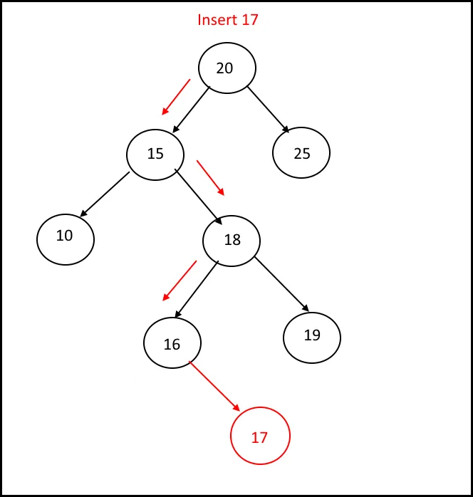
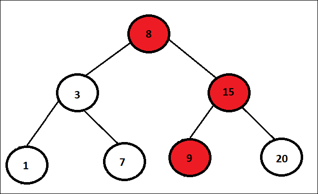
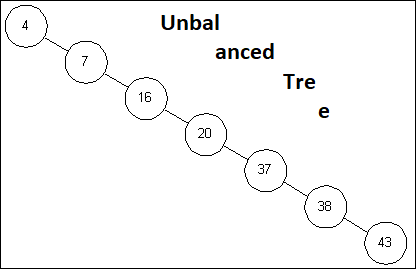
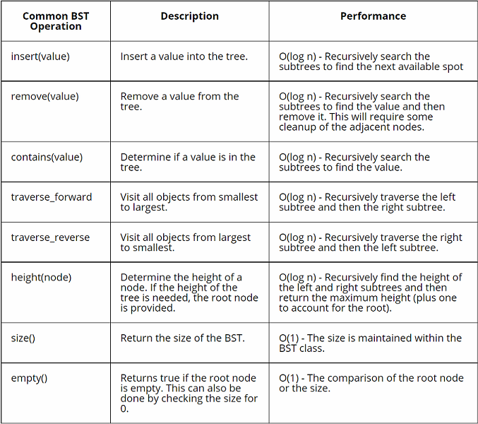
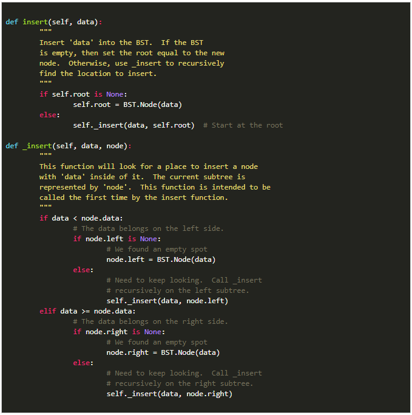
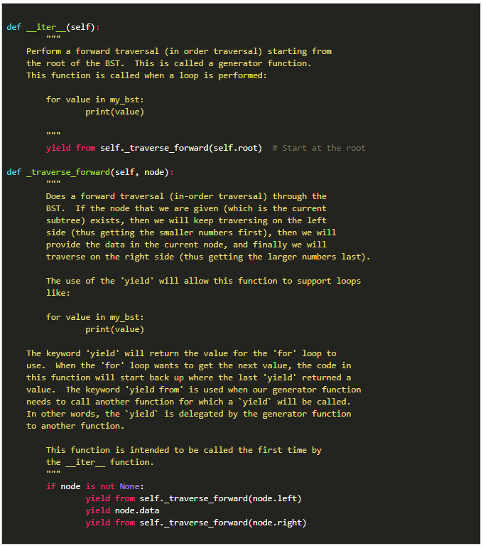

# Recursion

When writing code, functions are very helpful as they allow us to reuse code without rewriting each line. A function is
typically called from outside the scope of the function itself. In _**recursion**_, instead of calling the function from
outside the function, the function is called by itself. Because of this, it is very easy to create an infinite "loop".

To avoid unnecessary time and infinite recursion, it is important to design a recursion problem with two things in mind:
1. Make sure the problem gets smaller with each recursion call
2. Define at least one instance in which recursion will not happen. This is called a **base case**. It is typically just
a simple if/else statement.
   

Above we can see that the base case allows an exit from the recursion. Creating a base case that will eventually
execute is important. It is also possible to have more than one base case. Whether or not this is necessary depends on
the desired function as well as if at least one of the base cases will execute.

The efficiency of recursion is **O(2^n)**. ADD STUFF HERE YOU CANNOT TURN IT IN WITH INCOMPLETE THINGS.

# Binary Trees

This is not a binary tree. This is a Baobab tree. Easy mistake.

This is a Binary tree. A binary tree is made of nodes that individually connect up to two different nodes. There are a
few different terms related with a binary tree:
1.**Root**: The first node is called the _root_ node
2.**Parent**: A node that is connected to lower nodes is called a _parent_ node
3.**Child**: A node connected to a parent node is called a _child_ node
4.**Leaf**: Nodes without any connecting nodes are _leaf_ nodes

## Binary Search Trees

A **binary search tree** is a binary tree used to store data in an ordered fashion. Typically, a BST is used to store
numeric values. If the value is greater than the parent node, it is inserted as a child on the right. If less than the
parent node, it is inserted as a child on the left. 

Because a value must be greater or less than the parent value, it is typical that an equal value wouldn't be added to
the tree. This isn't necessarily a rule as the tree could be created a different way, but is this case with the trees in
this short tutorial.

### Efficiency

Most functions of a BST are O(log n) because it is ordered. When we add, remove, or search for a value we eliminate
half of the remaining tree as we progress down each node.

However O(log n) is only possible if the the tree is balanced. If it isn't, it approached O(n) as it would be in this
tree below.

## Helpful BST Operands

While Python does not have a built-in BST class, there are different libraries that one can be downloaded to help
implement this data structure. 

Above are some common operands used when implementing a BST in Python.

### Inserting in/Traversing  a BST

Recursion is key with BSTs as each node can be both a parent and a child. To insert, one must compare both left and
right children and then depending on which one, make it the parent and compare its children. 

To find specific data, one must traverse the tree in the same way to find the path to the desired data.

## Problem Set
