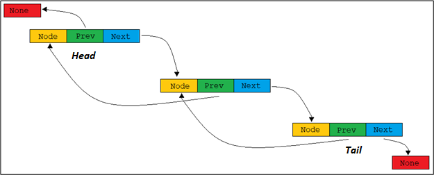

# Linked Lists
A linked list is another very useful type of data structure. In Python, an array is called a “list” so one would assume
that a linked list would be very similar because they are both “lists”. That is incorrect as the only applicable
similarity that a Python “list” (array) shares with a linked list is the ability to store data in memory. A fundamental
principle of arrays is that they are contiguous in memory. This is not so with linked lists.

Each item in a linked list can be anywhere in memory. Because of this, each item has “directions” that guide to the next
item in the list. These directions are contained in each “link” called a **node**. A node contains two parts, the data
stored and a memory address book that contains address for the previous and following nodes.

The nature of the linked list makes it impossible to jump directly to an item in the list. One must start from either
the front, called the head, or the tail of the list and iterate through each “link” until the desired data is found.
Because of this, looking up a value in a linked list is O(n).

## Inserting into a Linked List
In a dynamic array, inserting or removing data anywhere but at the head or tail is O(n) because of the sequential nature
of memory used to store the data causes all the elements stored to shift to accommodate the change.

A linked list is always O(1) to insert or remove from the head or tail, but it is O(n) to removing from the middle,
because you must iterate through the list to find the node you desire to add/remove. When one adds or removes an
element, care needs to be taken in the process since each element contains the addresses of the next and previous
elements.

#### Syntax
If there are no elements in a linked list, then creating a new list is simple. First, let's go over some helpful syntax
for working with linked lists:
**_self.head_** – this is the syntax that refers to the beginning element in a linked list.

**_self.tail_** -- this is the syntax that refers to the last element in a linked list.

**_self.next_** – for our purposes, _self.next_ is the syntax that points to the next element in the list.
_ex. self.head.next_ refers to the element immediately following the head.

**_self.prev_** _–_ for our purposes, _self.prev_ is the syntax that points to the previous element in the list.
_ex. self.tail.prev_ refers to the element immediately before the tail. **Note: _self.head.prev_ and _self.tail.next_
should always equal _None_ as they are on the ends of the linked list.**

**_self.data_** – this is the syntax that allows one to access the data stored in the node.

#### Creating a New Linked List
If there are no elements in a linked list, then creating a new list is simple. First, we need to create a new node and
set it to be both the head and the tail:

1. Set the new_node as the head: _self.head = new_node_
2. Set the new_node as the tail: _self.tail = new node_

Now what if we want to add another element at the end and create a new tail?

Let us call the new element _new_tail._
1. We first need to connect new_tail to the current tail: _new_tail.prev = self.tail_  _**0(1)**_
2. Now we need to attach the current tail to new_tail: _self.tail.next = new_tail_  _**0(1)**_
3. Now we need to make new_tail the current tail: _self.tail = new_tail_  _**0(1)**_

 The order here is very important. If these steps are done out of order you could lose the address of the element that
 had been before the original tail. It is important to attach the new node before removing the existing ties between
 nodes. This ensures that we still have links to all the data.
 
What if we want to insert a new head?

The idea is very similar to adding a tail. We will call the new element _new_head_:
1. We first need to connect new_tail to the current tail: _new_head.next = self.head_  _**0(1)**_
2. Now we need to attach the current tail to the new_tail: _self.head.prev = new_head_  _**0(1)**_
3. Now we need to make new_head the current head: _self.head = new_head_  _**0(1)**_

What about adding in the middle of the linked list? This is a little trickier as the middle of the linked list may not
be directly linked to either the head or the tail. This means we will have to iterate through the list to find the
location we will want to insert at.

The concept is the same as inserting a head or tail, but instead of attaching the new node to the head or tail, we will
be connecting the new node to the nodes that come both before and after. We will call the new node _new_element_ and
_curr_ refers to the current node:

1. We first need to connect new_element to the current node: _new_element.prev = curr_  _**0(1)**_
2. Now we need to attach new_element to the next element: _new_element.next = curr.next_  _**0(1)**_
3. Now we need to connect the next node to new_element: _curr.next.prev = element_  _**0(1)**_
4. Now connect the current node to the new_element: _curr.next = new_element_  _**0(1)**_

_It is important to note that while each of these operations is 0(1), it is O(n) to find the desired node. This is
   because we must iterate through the list to reach the node that we want_

In the above picture, the red arrows show how the new node was inserted into the linked list before the tail. The 2nd
node and the tail do not point to each other anymore, rather they now provide an address to the new node.

## Problem Set

In this problem set there are 3 separate problems to complete. Understand what the problem is attempting to accomplish
and then apply your knowledge of linked lists to revise/write the necessary code.

[**Problem Set**](https://github.com/stonks4elon/CSE212_final_project/blob/master/Linked%20List/ll_problems.py)
[_Problem Solution_](https://github.com/stonks4elon/CSE212_final_project/blob/master/Linked%20List/ll_solution.py)
