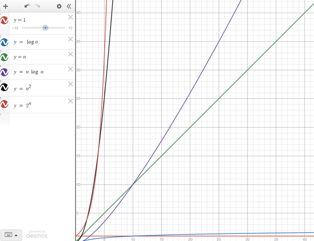
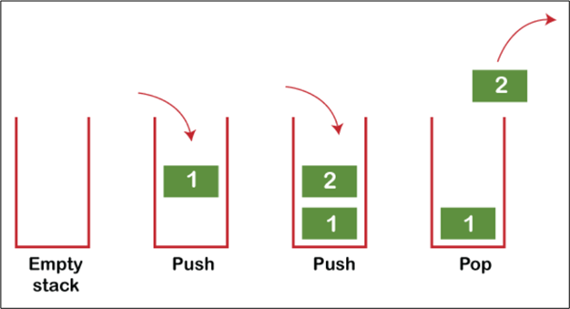

# Stacks

## Dynamic Arrays
A **dynamic array** is common data structure that is versatile in its ability to store and retrieve memory. A major
advantage of a dynamic array is its ability to expand automatically. Normal arrays are initiated with a size and cannot
expand or contract. The adaptability a dynamic array allows a programmer is great as many programs are created to work
with customizable settings.

## Big O Notation
**Big O notation** is a metric used in software creation to measure the efficiency of a program. Rarely is a program ran
with the exact same set of data every time. Most programs are there to perform a specific set of actions or
manipulations with many unique data sets. There are many (all) roads that lead to Rome. But we could probably agree this
is not the most _efficient_ route to Rome from Venice.

As such, there are an infinite number of ways to code a solution to a problem. But there are ways to make it more
efficient.  The most efficient program would take the same amount of time to run for one piece of data as it would
for 1 billion pieces of data. This is called **O(1)** efficiency. There are many different levels of efficiency in big O
notation:

**O(1)**  – Constant Time: The size of data to has no effect on the time it takes to run a program.

**O(log n)**  – Logarithmic Time: The execution time increase decreases with each additional item of data.

**O(n) –** Linear Time: The execution time increases with relation to the size of the data.

**O(n log n)** -- Logarithmic Time

**O(n2)** – Polynomial Time: The execution time increases by a fixed power in relation to the input size.

**O(2n)** – Exponential Time: The execution time increases by a power equal to size of the input.

## Stacks
**Stacks** are a great data structure to be able access data quickly and efficiently. A stack stores data inside of a
dynamic array. This allows the amount of data stored to increase or decrease as necessary providing great versatility.
In a stack, data is always added or removed from the end. In other words, the last piece of data entered a stack, is
always the first out **(LIFO)**.

###Efficiency
A fantastic advantage of a stack is the algorithmic efficiency. Adding to or removing from a stack is always O(1). We
always add to and remove from the end of the dynamic array. The execution time of this does not depend on the size of
the array because none of the elements must shift. Contrarily, if we added to or removed from the beginning, the
efficiency would be O(n). This is because each element in the array would be required to shift for each item added or
removed.

###Real Life Examples of Stacks

To remove the bottom bullet from a gun magazine, you must remove all the bullets that were entered after it. Unless
you cut it open like this the person who took this image. Then you have ruined my example.

According to the Geneva Convention of 1929, you are only allowed to take from or add to the top of the pile. Any other
method is classified a war crime and punishable by death. – Abraham Lincoln

_Source: definitely not Wikipedia_

##Programming Applications
 
*The above photos are the only two officially licensed keyboards of Stack Overflow*

Stacks are a great tool in programming. They are often used in undo/redo features in programs or other applications
where quick, ordered memory is to be accessed.

Stack memory is also used while running a program. The computer must remember where is has been, and where it must go
to. A great example of this is with functions. Functions are defined throughout code. As a program progresses, it often
needs to jump to different parts of the code to run instructions found there. But it must also remember where it was so
that it can return to compiling to program in the correct order. Stack memory allows the computer to quickly see where
it must go, by adding to the top of the stack, and where it must return to, by removing the item on top to uncover the
last known bit of memory, or location to return to in the program.

##Useful Python Functions
**pop() –** the pop() function is core to stack memory’s function. When this function is called, the last item in the
array is returned. It is important to remember that it also removes that item from the array.

definition.png)

code.png)

**append() –** to add onto the stack, one must use the append() function in python.

definition.png)

code.png)

**len() –** the len() function takes one parameter, in this case, the array. Since the pop() function removes data from
an array, it is important to make sure there is data present to being with. If one calls the pop() function on an empty
array, they will encounter an error.

definition.png)

code.png)

##Problem Sets

Don't sound so excited.

[**Problem Set 1**](https://github.com/stonks4elon/CSE212_final_project/blob/master/stack_problem_1.py)
[_Solution 1_](https://github.com/stonks4elon/CSE212_final_project/blob/master/stack_solution_1.py)

[**Problem Set 2**](https://github.com/stonks4elon/CSE212_final_project/blob/master/stack_solution_1.py)
[_Solution 2_](https://github.com/stonks4elon/CSE212_final_project/blob/master/stack_solution_1.py)

